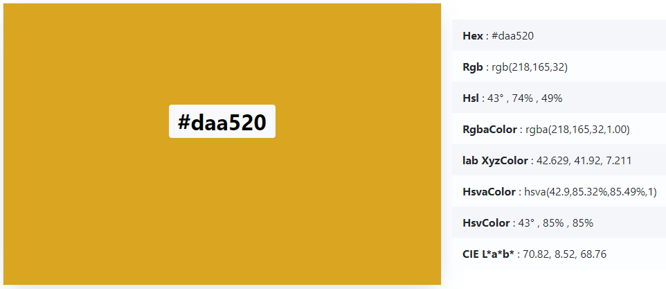
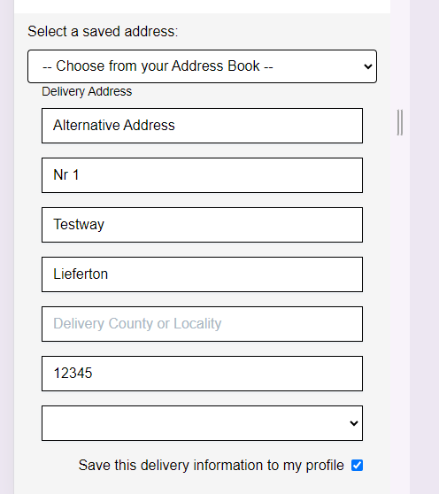
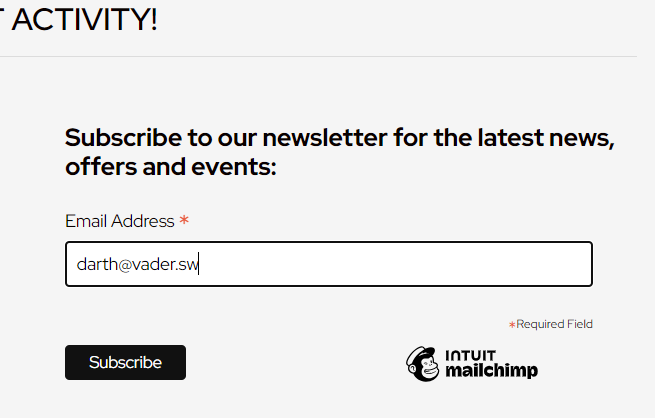

## Welcome to my Project 5: Coffee and Honey

## A note on Testing
I have separated the results of my site testing into a different file called Test Results.

## Why and what is 'Coffee and Honey'?

One of my hobbies is beekeeping, and I briefly considered setting up a website that sells beekeeping equipment; however, I thought there are more possibilities in cafe-style business, such as bookings (tables, function room and hive-tours) than in a straight-forward e-commerce shop, so decided to merge my two ideas and interests. This has some parallels in real-life: many bakeries were I live in southern Germany sell jars of honey from local beekeepers (although these bakeries do not usually have an online presence) and I thought that would be an interesting add-on to the type of coffee shop that are familiar to me from England and Ireland.  

Merging the two ideas also gives a catchy and memorable name that describes the website's buisness in concise and clear terms. 

## Background and goals
I have long been a fan of coffee shops where you can enjoy decent coffee and cake, maybe a freshly made sandwich, and spend time either meeting friends, reading a book
or simply staring out of the window. I am as happy in a good chain or franchise as I am in an independent, but a good independent coffee shop
will always hold a special place in my heart. Sadly, I have seen several such independents go out of business because the margins are so fine 
and the competition is so tough. However I have also seen many independents try to expand their businesses by selling or offering extras, from function rooms in which yoga classes
or toddler groups are held, selling cups and teapots or even installing a bookstore. Some ideas have worked and some have not, but I thought this would be 
an interesting project to take on for P5: how could an independent coffee shop establish an online presence that would help it:

- make money by selling products online  
- advertise extra services such as function room booking
- allow a limited amount of table reservations 
- offer a hive-tour for anyone interested in bees and beekeeing (see below for background)
- and by doing all this, expand its business by becoming better known locally 

These are therefore the aims of my P5 project website and fictional company Coffee and Honey.

## Business Case
Coffee and Honey is imagined as a local indpendent coffee shop. It is a B2C business focusing primarily on adults aged 30 and up. It opens 8:00 - 18:00 Monday - Friday, and for shorter days at the weekends, so local people, office workers, parents and retired people are the likely week-day clientele, whereas Saturdays and Sundays might well have a younger audience of people who want to meet friends or revive themselves with a leisurely coffee after a busy night out / long week.  

Social media would certainly be necessary and I envisage both Facebook and Instagram being popular.
- Facebook as a business page with business details (opening hours, reviews, interactions etc)
- Instagram because the subjects are photogenic and interesting. People who enjoy coffee often enjoy photos of coffee and coffee-related items, from the raw beans to the foam on a cappucinno. Honey and beekeeping is also photogenic and it would be fairly straightforward to post interesting photos and videos on a regular basis to generate interest and appeal to the customers. 
- The type of content would be a mix of information (basic business information) but primarily enterainment, with enjoyable and interesting photos of Coffee and Honey's primary topics: coffee, honey and cake.  

As it is a small independent business, I removed the 'free shipping' threshold. I imagine the basket size would not be much more than 30 - 40€, and probably more likely around the 20€ mark, including shipping; offering free shipping would be cost that business could probably not afford, and I'm doubtful that it would work as an incentive for customers to buy either more coffee or honey. Instead, I have offered the customers the chance to pick up their order for free in the cafe as an alternative to having it shipped by post.  

As the website in this case would start off being more supplementary to the company rather than the main earner, there would be little marketing budget to spend on online advertising. Given the subject matter, however, clever use of social media and SEO would be a cost-effective and overall effective way of raising the coffee shop's profile amongst local people, and engaging in word-of-mouth marketing.  

Since gift-wrapping would be a nice add-on in a future iteration of this project, an occasional newsletter with gift ideas at Christmas, or a monthly newsletter letting people know about the beekeeping year and suggesting birthday gift ideas, would be a realistic option. 

I got further into the marketing requirements of this project in the "Marketing: Facebook, MailChimp and SEO" section below.  

## Key Technology
Django Web Framework
Python
Bootstrap front-end framework, with Bootstrap CSS and JS
HTML
CSS
Javascript
PostgreSQL supported by the CodeInstitute (https://dbs.ci-dbs.net/)
Stripe 

# Overview: Website and Functionality

As will be clear, the website relies heavily on the Boutique Ado Walk-Through project, particularly for the shopping bag and checkout process. However, my imagined Coffee and Honey cafe is a bit more limited in terms of the number of products it offers, and sells a different type of project with different pricing structure. Additionally, I have focused on fleshing out the My Profile section by adding an address book, and linking that to the checkout so that the customers have flexibilty in terms of delivery address; additionally, I have set the checkout up to prepopulate with saved billing / delivery addresses, and enabled a pick-up option for the customers to pickup their order directly from the cafe. 

I have hopefully provided sufficient independent development away from the Boutique Ado example.  

# MVP

## Website functionality 
The MVP allows customers to:
- browse and purchase products 
- add items to the shopping bag, and edit the shopping bag 
- create an account in which their basic details and order history are saved
- choose between home delivery, delivery to friends / family, or pick-up in the cafe
- complete an order as a 'guest', i.e. not logged in
- complete an order using their credit card hosted by Stripe (currently test data only!)
- the account also allows them to add / edit / delete addresses which are saved to their profile.

In this sense, CRUD functionality is available both in the shopping bag and in the profile.  

The MVP version of my project takes orders for the following: 
- bags of coffee beans in different sizes (250g, 500g, 750g, 1000g)
- customers can choose to pay a small surcharge to have them freshly ground before shipping 
- jars of honey in two different sizes: 340g and 500g  
The price of both product category is calculated according to the weight.  

## Admin
The admin interface can be accessed by a superuser who can do the following: 
- Add categories
- Add products to the categories
- Upload product images, add descriptive text, provide product details and set the price 
- Set extra services (such as coffee bean grinding or gitf wrapping)
- View user information (username, email address, etc)
- Set different permission levels: staff and superuser  

## Security
All sensitive information such as the secret key is set in env.py which is added to .gitignore in Gitpod, and to the Heroku config vars for deployment. Debug is set to False.  

The front-end and back-end security is provided by the @login_required decorator along with CSRF protection implemented via the  template tag.

# Design and UX

## Design and brand image
I wanted to create a slightly warm or cosy image, and settled on the 'goldenrod' base colour as a midway point between coffee brown and the different shades of honey.

I have chosen pictures that transmitted to me a warm and slightly vintage feel which I feel would be appropriate for a typical customer, who I imagine would be between 30 and late 50s (maybe older).

As I struggled to find product images for the coffee and honey, I used OpenAI's Dall-E image creation functionality to generate product images appropriate to my website. All other product images are from Pexels and have been acknowledged with comments in the code.  

## Homepage
I designed the homepage to make the navigation redundant for customers who know what they want, and who want to checkout as quickly as possible. Particularly on mobile, I wanted the customer to be able to choose their product and checkout via the shortest possible route; therefore the two main product categories are listed at the very top of the page and allow the user to access the products directly, without going via the navigation. The navigation is of course still there and functional, but on mobile and tablet it is hopefully not necessary. 

## Checkout
I made a couple of changes to the Boutique Ado format in order to streamline the checkout process for the customer:

Firstly: users who are logged in and have a billing address will have the billing address prepopulated for them. As this is assumed to be the default shipping address, unless otherwise stated by the customer, this saves the customer time and repetitive entry of data which the shop already has stored. This is a good way to optimise the conversion rate.  

I took inspiration from two large corporations for two other features on the checkout page:

- Address book: I find Amazon's address book incredibly useful, especially as I live abroad away from my family and many of my friends. I decided to integrate a similar functionality to my website project so that customers can ship the products as gifts, and save the address information for future purchases.

- Pick up option: Lego's German site has the option to have your delivery shipped to a pick-up shop; as Coffee and Honey is imagined to be a local cafe, I thought this would be a realistic and useful feature to implement in the checkout. It also saves the customer money on shipping costs, which they might well spend in the cafe on food and drink.

Lego Germany (English language version): https://www.lego.com/en-de/

# Site Overview
In this section, I focus on other functionalties that were not present in the Boutique Ado project.  

## Products: type and pricing 
Unlike the products on Boutique Ado, the prices of both coffee and honey are linked to their weight; therefore I set up the product model to allow for products with a straight-forward price class (as on Boutique Ado) and for products like mine where the price is linked to the weight (i.e. size).

## Coffee
I offer three types of coffee: Arabia, Colombian and Robusta. Each type is offered in 4 weight variants (250g, 500g, 750g, 1000g) with the price increasing accordingly (5.99, 9.99, 14.99, 19.99)

## Extra Service
For coffee I have implemented an optional extra service called 'Freshly Ground' which allows the customers to have their coffee beans ground on the day of shipping. This is a flat-rate for all weight classes, though the price could be refined in next iterations. It is a good option for the customer who might not have a coffee grinder at home, and it helps increase the basket size for the business.

The 'extra service' option is currently only available for the coffee product cateory. However, it need not be limited to only grinding coffee beans, and could be easily rolled out to  on in the future to offer gift-wrapping, for examplem for both coffee and honey, and any other product categories which could be added to the site (coffee mugs, honey dippers, etc). 

Additionally, a future iteration could see this option remain available in the shopping bag for any customers who didn't choose it on the product detail page. 

## Honey
Like coffee, I offer three types of honey: Flower, Forest and Heather. Flower and Forest honey are offered in two price / weight classes (340g for 4.99 and 500g for 6.99). Heather honey is only offered at the 500g class for 9.99 given the more time-consuming method of extracting the honey from the honey comb.  

# My Account: Address Book
I spent a significant amount of time on the account as I wanted to make the checkout process as smooth and flexible as possible. Building on the 'my orders' section of Boutique Ado, I have added a 'my addresses' section so that customers can save the address of friends and family to whom they might send the products.

Unless the customer signifies otherwise, the default shipping address is the billing address, but the customer has the option to select another address as their default by clicking on 'Set as Default'. They can change the default shipping address either by choosing another saved address, or by clicking the 'set as default' to remove it and reset to the billing address. The customer receives on-screen acknowledgment for each change, either by a toast or by an on-screen message. Finally the default delivery prepopulates the address fields in the checkout. 

## Addresses: CRUD functionality 

## Add Address 
In this page, you can simply add an existing address; you can also click on a 'set as default' button here to make this delivery address default.  

## Edit Address
In this page, you can simply change an existing address; you can also click on a 'set as default' button here to make this delivery address default.  

## Delete Address
By clicking on delete address, you trigger a modal to check that you want to really want to delete it, in which you can either cancel the deletion or confirm it. If you delete a default delivery address, the default resorts to the billing address.  

 

## Welcome Message and Toasts
I liked the feature introduced to us in Project 4 whereby the user is welcomed with their username if logged in, or prompted to log in, at the top right of the screen, so I added it to this project as well as a reminder to the customer where they are in the process.  

I also implemented the Toast functionality from the Boutique Ado with some minor changes, such as changing the 'Go to Checkout' at the PDP to 'Go to Bag' to more accurately reflect the process (this could also have been my misunderstanding of the walk-through project, however. )

## Bag
In the Bag, the customer can change the quantity of the products or empty the bag altogether. I have tried to line up the overview a bit more precisely by using a table.

The customer can proceed to the checkout from the bag as a guest user, but I added a modal to the 'proceed to checkout' button to prompt them to log in, or confirm the checkout as guest, if that's what they want.

Finally, there was some horizontal scroll in the mobile version of the Boutique Ado Bag - this was probably due to my faulty implementation of it! I worked on eliminating it by changing button sizes and responsiveness, but at a width of 320px there is still some minor horizontal scroll that I could not quite eliminate for this MVP.

## Checkout
Upon reaching the checkout, the customer has an overview of the products in the bag, and three shipping options: to billing, friends and family or pick-up at the cafe itsef.

   

An overview of the differences: 
- Billing Address: this should be the default with the billing name and address pre-populated so the customer doesn't have to repeat themselves. *Bug* At the time of writing, the checkout opens at the delivery address and the billing name does not prepopulate.  

- Shipping to Friends and Family: the billing address remains visible so that the customer can check this; additionally, credit card purchases may require this information to be transferred to be present in the purchase. Depending on whether the customer is logged in or purchasing as a guest, three things happen. 

For logged-in customers: 
1. Delivery address fields appear for the customer to fill in the different delivery address.

  

2. If the customer is logged in and has set a default shipping address that is different to their billing address, this is prepopulated.

3. A drop-down menu appears for the customer to choose from an existing saved address. If they choose one, it prepopulates all fields apart from the country field.  

  

4. If they want to ship to a new address, they can simply complete the fields with the new details.

For the guest customer: 
1. The address fields appear for them to complete, but no dropdown menu with saved addresses is shown.  

- Pick-up at the Cafe:
In this case, the billing address remains constant on-screen, but the delivery price switches to zero as there is no charge for a pick-up.  

Whatever option is chosen, the delivery address is shown on the checkout success page as appropriate.  

## Features not implemented 
- Function Room
- Bee hive tour  

# Database and Models

My database is supported by a PostgreSQL database issued by the Code Institute. Here follows an overview of the models I created, the methods I added to the models I took from Boutique Ado together with any other important changes I made to the fields in the models from Boutique Ado.

## The Products App

The base products model (based on Boutique Ado): for orientation with the two new models below:

  

**Product Variant model:** 

  

This model was necessary as I wanted to offer variations of the same product based on different weight categories, e.g. coffee beans in weight classes of 250g, 500g, 750g and 1000g, and honey in 340g and 500g. In this model, the product field is a FK, structuring a weight class variant to a specific product, allowing for the above weight structure, and allowing the admin to structure multiple price categories per product per weight.  

This approach enables a drop-down display of the different weights / prices on the PDP without requiring a different page per weight class, which would naturally be rather clunky. In a future iteration it should also be possible to filter relevant products by weight class via a search field or the navigation bar.

I could not fit this into the standard Product model in a neat way, which is why I created a separate model. Additionally, this approach supports future maintenance by clearly distinguishing products with weight categories from those without, making it easier to add new products.

**Services model:** 

  

This model defines optional service add-ons for products. In this MVP, I’ve included only bean grinding, but this could easily be expanded to options like gift-wrapping in the future—an attractive feature for customers and a potential revenue stream for the business.

The Service model is linked to the Product model through a Many-to-Many relationship in a field called extra_services. This setup is important because it allows certain services to be offered only for specific products (e.g., coffee bean grinding should not appear on honey product detail pages). However, other services, like gift-wrapping, could be made available across multiple product categories. This approach is straightforward and supports both scalability and reusability as the product portfolio grows.

## The Profile App
**Recipient Address model:** 

 

I added a RecipientAddresses model to my profiles app to enable an 'Address Book' type feature for my customers. It is linked to the UserProfile, which serves as the FK for this model, linking any details stored in the model to the relevant user, and only to that user. The Django framework sets an id to each address, which serves as the PK within the model itself.  

I wanted to make the checkout process as smooth as possible; Amazon's checkout inspired this section, as the Address Book feature is excellent. I also wanted to avoid the customers having to re-type in addresses they have already used on the site in order to encourage repeat business from returning customers.  

The model itself is quite straightforward in the sense that it is simply the recipient address details, together with an optional nickname to save the address under, and the option to set it as the default shipping address. This I thought would be a nice option for people ordering for family or even for businesses.   

## Checkout: Order model and Delivery Options method
**Order Model**: 

I have expanded the Order model and added several methods to make the checkout process as seamless as possible for customers. 

To start with: in order to differentiate between billing and delivery addresses, I have prefixed each address-related field with "billing_". This  helps clearly distinguish the default billing address from a separate delivery address, in cases where they differ. 

Additionally, I added a number of new fields to manage delivery and pick-up options:

- different_delivery_address (models.BooleanField(default=False)): This field allows the database to capture a different delivery address if specified by the customer. By default, this field is set to False, meaning that the billing address is used as the delivery address unless the customer specifies otherwise. When the customer chooses to have their order delivered to a different address, this field is set to True, and opens the way to capturing the customer's delivery address details in the fields prefixed with 'delivery_' listed further down the model. This provides flexibility for cases where the order needs to be shipped to a different location.

- pick_up (models.BooleanField(default=False)): This field enables a pick-up option, allowing customers to collect their orders 'in-store' at the cafe instead of having them delivered. When pick_up is selected, delivery costs are set to zero, and the system bypasses the delivery address fields, making the checkout experience simpler and more efficient for local customers. Given that "Coffee and Honey" is a local independent cafe, this feature offers a realistic and user-friendly option, catering to customers who prefer pick-up to avoid shipping costs.

**Delivery Options method:** This method (delivery_options) provides flexibility in the checkout process by catering to different delivery and pick-up scenarios:

- self.pick_up: This flag handles the scenario described above where the customer wants to pick up their order at the cafe. When selected, the delivery cost is set to zero, and only the billing address fields are shown.  

- self.different_delivery_address: This flag opens up three options for delivery:
i. Saved Address: If the customer has saved delivery addresses in their profile, they can select one from a drop-down menu in the checkout.
ii. New or Unsaved Address: If the customer doesn’t have any saved addresses, is checking out as a guest, or if they wish to ship to a new address, they can enter a new delivery address here.
iii. The else condition - Default Billing Address: In the absence of any specific delivery address, the else condition pre-fills the delivery fields with the billing address by default.

For instances where the address fields are to be populated with saved data, this method makes a call to the 'copy_address' helper method (see below).

This method is designed to react to the customer’s chosen options, whether they’re using saved addresses, entering a new address, or opting for in-store pick-up. This flexibility should in theory help optimise the conversion rate from baskets into actual sales.  

**Copy Address method**: 

This (copy_address) is a helper method designed to populate the delivery address fields (or billing fields if adapted) with address information that the customer has saved to their profile. It supports the logic in the delivery_options method by allowing saved delivery or billing address details to be copied directly into the delivery address fields without manually setting each one individually.

## Marketing: Facebook, MailChimp and SEO

**Facebook:** I set up a functioning Facebook business page and have fully documented it in this document. It is also linked from my footer although, as is known, it may get taken down by Facebook as it is not a genuine company. Given that it will probably get taken down, I have added a nofollow link to it. If this were a real business, however, I would not link it via nofollow, sa I would want the Facebook page to be fully linked to my website.

Link to page: https://www.facebook.com/profile.php?id=61567575580447

**MailChimp and Newsletter sign-up:** I have set up a MailChimp account and embedded the newsletter sign-up in the footer of my project. The following screenshots demonstrate its functionality.

**404 Page:** I have set up and tested a custom 404 page that directs the user back to the homepage.

**SEO:**
- No-follow links: the footer contains links to the company's Facebook page (see above), Instagram homepage, Fairtrade Coffee and MailChimp, all of which include the rel="nofollow" attribute. 
- There are no orphan pages: all pages can be reached from another findable page either through the navigation menu, footer or in-page links.
- Block meta in base.html contains the meta title, keywords and description.

- A sitemap is available in the root directory.
- A robots.txt file is available in the root directory.
- There is no lorem ipsum text at all.  

# Planning and Agile Methodologies

I followed the Agile methodlogoy as outlined in the "I think therefore I blog" according to the MoSCow proiritization. Following feedback on my Project 4, I also tried to make use of epics and milestones in my workflow.  

## Commit messages
Also following feedback on my 4th project on 1st October, I started writing my commit messages according to the conventions listed here: https://www.conventionalcommits.org/en/v1.0.0/#summary
Therefore there is a change in the style of the commit messages from that date.

## User Stories, Epics and Milestones
Here is the link to my Kanban board: https://github.com/users/rich-p-rich/projects/7

At the time of writing, I have completed 47 user stories which I divided up into 10 epics and 8 milestones. Here are the epics; I completed the MVP for each of them apart from Epic 10 'The Function Room', for which I ran out of time.

I also followed the MoSCow prorisation principle for organising my work, as I did with Project 4. One difference between Project 4 and 5 that I cut my stories up into smaller slices which I think helped keep a better overview; additionally, it provided a welcome feeling of momentum and I feel that the Kanban board was well integrated into my project this time around as it served as my primary planning tool throughout the project.  

Similarly, I used Milestones to keep track of the bigger picture throughout my project. I set them up as follows:
- Milestone 1: basic website layout, navigation, user registration, basic bag functionality 
- Milestone 2: edit bag, Toasts, proceed to checkout, Stripe implementation with Webhook handlers 
- Milestone 3: profile app fleshed out with view account details, order history, save addresses, CRUD functionality for saved addresses 
- Milestone 4: checkout aoo fleshed out with address fields pre-population from saved addresses, fix delivery prices, default shipping 
- Milestone 5: Heroku connection, deployment in stages, deployment testing 
- Milestone 6: marketing including sitemap and robots.txt, Facebook page, newsletter signup, meta keyword optimisation, no-follow links and 404 page
- Milestone 7: code validation (e.g. PEP8) and ighthouse testing
- Milestone 8: site testing, documentation of results, complete ReadMe

This helped me break down the tasks into what felt were realistic and unified goals; like the rest of the Kanban board, it felt a genuine part of my project planning and I made regular updates to it.  

