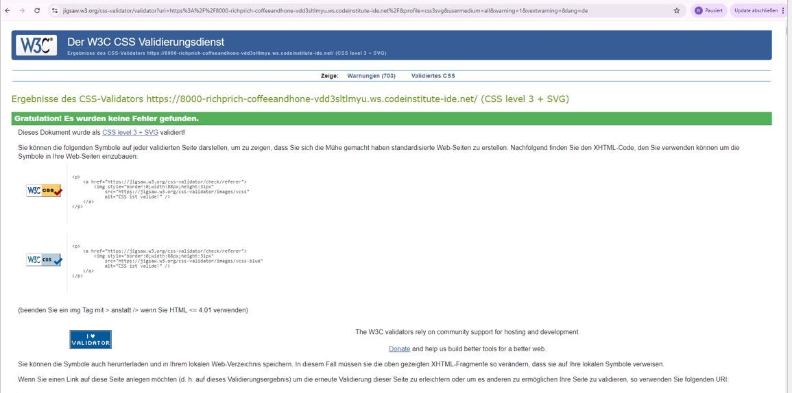

# Project 5 E-commerce 'Coffee and Honey': Test Results and Overview 

This document details the testing I have done for my Project 5. I have separated the testing out of my ReadMe, as that document was already quite long.

Unfortunately I was unable to implement automated testing properly, so all testing was done manually.

## Lighthouse 

The site performs well on Lighthouse.

Testing method: open an incognito tab -> open project link -> open DevToops -> run Lighthouse check.  

- Mobile

- Desktop

## HTML:

- Resource used: https://validator.w3.org/
- No Errors
- Method of testing: direct input

## CSS
- Resource used: https://jigsaw.w3.org/css-validator/
- No Errors
- Method of testing: direct input

## Javascript
- Resource used: JSHint: https://jshint.com/
- My JS passes throws no errors

I added the following comments to JSHint so it recognised which version to use, and that I was using Bootstrap in my project: 

- /* jshint esversion: 6 */
- /* global bootstrap */

## Python
- Resource used: https://pep8ci.herokuapp.com/

Note: I did not check auto-generated files such as migrations and ___init__.py.  
In some cases, no new line was detected when cross-checking files copied from GitHub rather than GitPod. I could not find a clear reason for this on StackOverflow or any other online discussion.

|Test file                                          | Outcome	                |  Comments              
| ---------------------------------------------	| ---------------------------------	| -------------------	  	
|Bag - apps.py                    |  Clear      | -    |  
|Bag - contexts.py                   |  Clear      | -    |  
|Bag - urls.py                   | Clear      | -    |   
|Bag - views.py                     | Clear      | -    |   
|                    |       |    |   
|Checkout - init.py                     | Clear      | -    |  
|Checkout - admin.py                     | Clear      | -    |    
|Checkout - apps.py                     | Clear      | -    |   
|Checkout - forms.py                     | Clear      | -    |   
|Checkout - models.py                     | Clear      | -    |  
|Checkout - signals.py                     | Clear      | -    |  
|Checkout - urls.py                     | Clear      | -    |  
|Checkout - views.py                     | Clear      | -    |  
|Checkout - webhook_handler.py                     | Clear      | -    |  
|Checkout - webhooks                     | Clear      | -    |
|                    |       |    |   
|Coffee and Honey - asgi.py                    | Clear       | -    |  
|Coffee and Honey - settings.py                   | Clear       | Blank and trailing spaces corrected; otherwise I followed Joanna Gorska's advice here https://www.youtube.com/watch?t=1648&v=6j9dZTW4owI&feature=youtu.be and added # noqa as appropriate -    |   
|Coffee and Honey - urls.py                     | Clear      | -    |  
|Coffee and Honey - wsgi.py                     | Clear      | -    | 
|                    |       |    |   
|Home - apps.py                     |  Clear     | -    |   
|Home - urls.py                     |  Clear     | -    |   
|Home - views.py                   |   Clear    | -    | 
|                    |       |    |   
|Products - admin.py                     |  Clear     | -    |  
|Products - apps.py                     |  Clear     | -    |  
|Products - models.py                     |  Clear     | -    |   
|Products - urls.py                     |  Clear     | -    |   
|Products - views.py                   |   Clear    | -    | 
|                    |       |    |   
|Profiles - apps.py                     |  Clear     | -    |  
|Profiles - forms.py                     |  Clear     | -    |   
|Profiles - models.py                     |  Clear     | -    |   
|Profiles - urls.py                     |  Clear     | -    |   
|Profiles - views.py                   |   Clear    | -    | 
|                    |       |    |   
|Root directory - manage.py                   |   Clear    | -    | 

## Site functionality testing

Browsers used:
- Google Chrome

<!-- 
- Mozilla Firefox
- Microsoft Edge
- Apple Safari (from I-Pad)
- Samsung Internet version 25.0.1.3 on a Samsung A33
--> 

**Test 1. Homepage and Base.html frame**
|Test                                           | Expected outcome	                |  Result             | Passed all Browsers?
| ---------------------------------------------	| ---------------------------------	| -------------------	 | -------------------	 	
|Hompage - bag                         | Bag is always accessible         | Pass   |  yes
|Hompage - navbar links                         | All products, coffee dropdown, honey dropdown, account work         | Pass   |  yes
|Hompage - navbar links                         | Accessible via burger icon for mobile & tablet         | Pass   |  yes
|Navbar -  burger bar (mobile only)        | Opens navigation         	        | Pass    | yes 
|Hompage - navbar - click all products               | shows all products               | Pass  | yes
|Hompage - navbar - click coffee                    | All coffee types are available, plus 'All Coffee'              | Pass  | yes
|Hompage - navbar - click honey                     | All honey types are available, plus 'All Honey'             | Pass  | yes
|Hompage - navbar - click bookings                    | Refreshes page          | Pass  | yes
|Hompage - navbar - account - register                   | Opens signup page, customer can register             | Pass  | yes
|Hompage - navbar - account - login                  | Customer can log-in            | Pass  | yes
|Hompage - navbar - account - if logged in           | Customer can access my profile page           | Pass  | yes
|Hompage - navbar - account - if logged in                | Customer can logout           | Pass   | yes 
|Hompage - footer - Fairtrade foundation        | Opens link to Fairtrade foundation in new tab        | Pass   | yes 
|Hompage - footer - Facebook            | Opens business FB page / Facebook home in new tab | Pass  | yes
|Hompage - footer - Newsletter email field and subscribe  | Allows any user to sign-up for the newsletter      | Pass   | yes 

**Test 2. Products: Coffee and Honey**
| Test                                   | Expected outcome                                        | Result | Passed all Browsers? |
|----------------------------------------|---------------------------------------------------------|--------|-----------------------|
| Hompage - All products                 | All product categories can be reached to Arabica category | Pass   | yes                  |
| Hompage - All PDPs                     | Have a product image and description                    | Pass   | yes                  |
| Hompage - All PDPs                     | Have functioning 'keep shopping' and 'add to bag' buttons | Pass   | yes                  |
| Hompage - Coffee - Arabica             | Leads to Arabica category                               | Pass   | yes                  |
| Hompage - Coffee - Colombian           | Leads to Colombian category                             | Pass   | yes                  |
| Navbar - Coffee - Robusta              | Leads to Robusta category                               | Pass   | yes                  |
| Navbar - Coffee - PDPs                 | All PDPs have 4 weight/price classes which are selectable | Pass   | yes                  |
| Navbar - Coffee - PDPs                 | All PDPs have the option to choose 'freshly ground' extra service | Pass | yes               |
| Navbar - Coffee - PDPs                 | All PDPs have the option to add any weight class to bag, either single or multiple without extra service | Pass | yes |
| Navbar - Coffee - PDPs                 | All PDPs have the option to add the extra service to the product, either single or multiple without extra service | Pass | yes |
| Hompage - Honey - Flower               | Leads to Flower honey                                   | Pass   | yes                  |
| Hompage - Honey - Forest               | Leads to Forest honey                                   | Pass   | yes                  |
| Hompage - Honey - Heather              | Leads to Heather honey                                  | Pass   | yes                  |
| Navbar - Honey - PDPs                  | All PDPs have the option to add any weight class to bag, either single or multiple | Pass | yes |

**Test 3. Account: My Profile**
| Test                                   | Expected outcome                                        | Result | Passed all Browsers? |
|----------------------------------------|---------------------------------------------------------|--------|-----------------------|
|My profile page                | Only available to logged in and authenticated users            | Pass  | yes
|My profile page                | Displays billing address, order history and a link to manage my addresses            | Pass  | yes
|My profile page                | Billing details can be updated            | Pass  | yes
|My profile page                | Manage my addresses button leads to 'saved addresses          | Pass  | yes
|Saved addresses page                | Billing address does not show       | Pass  | yes
|Saved addresses page                | Any saved addresses can be viewed         | Pass  | yes
|Saved addresses page                | A new address can be added        | Pass  | yes
|Saved addresses page                | Any address can edited, partly or wholly        | Pass  | yes
|Saved addresses page                | Any address can deleted, partly or wholly        | Pass  | yes
|Saved addresses page                | Delete button triggers warning modal to confirm deletion      | Pass  | yes
|Saved addresses page                | Any delivery address can be marked as default shipping address    | Pass  | yes
|Saved addresses page                | It is possible to remove default shipping status from any address    | Pass  | yes
|Saved addresses page                | If default status is removed, and no other delivery address is marked as default, billing address is default shipping address    | Pass  | yes
|Saved addresses page                | Only one address at a time can be marked as default   | Pass  | yes
|Saved addresses page                | Back to profile page button leads back to profile page  | Pass  | yes

**Test 4. Shopping Bag**
| Test                                   | Expected outcome                                        | Result | Passed all Browsers? |
|----------------------------------------|---------------------------------------------------------|--------|-----------------------|
|Bag                 | Accessible from every page           | Pass  | yes
|Bag - empty               | Empty bag message shown           | Pass  | yes
|Bag - product info               | Image, size and SKU visible         | Pass  | yes
|Bag - product info            | Quantity accurate and itemised        | Pass  | yes
|Bag - product info            | Correct price shown        | Pass  | yes
|Bag - extra service            | If chosen in PDP, itemised in bag        | Pass  | yes
|Bag - extra service            | If chosen in PDP, correct price shown        | Pass  | yes
|Bag - extra service            | Shown only once as a flatrate, regardliness of how many packs of coffee shown  | Pass  | yes
|Bag - extra service            | Absent if not chosen   | Pass  | yes
|Bag - adjust bag            | increments / decrements chosen quantity accurately   | Pass  | yes
|Bag - adjust bag            | Subtotal adjusts accurately according to quantity  | Pass  | yes
|Bag - adjust bag            | Extra service does not increment  | Pass  | yes
|Bag - remove product         | Removes product from bag compeletely  | Pass  | yes
|Bag - bag total        | Correctly sums up the price of all products and services  | Pass  | yes
|Bag - delivery        | Displays shipping costs | Pass  | yes
|Bag - grand total        | Correctly calculates bag total plus delivery | Pass  | yes
|Bag - keep shopping       | Brings customer to all products | Pass  | yes
|Bag - go to checkout       | Brings customer to checkout | Pass  | yes

**Test 5. Checkout and Payment**
| Test                                   | Expected outcome                                        | Result | Passed all tested Browsers? |
|----------------------------------------|---------------------------------------------------------|--------|-----------------------|
|Checkout                 | Only accessible via bag          | Pass  | yes
|Checkout                 | Only accessible if bag has items          | Pass  | yes
|Checkout                 | Three delivery options are displayed          | Pass  | yes
|Checkout - Home/Billing address | Opens on Home Delivery as default          |No -> Bug  | 
|Checkout - Home/Billing address | No other delivery address fields are shown          | Pass  | yes
|Checkout - Home/Billing address | Billing name is prepopulated          | No -> Bug  | 
|Checkout - Home/Billing address | Billing address is prepopulated          | Pass  | yes
|Checkout - Delivery to Friends & Family | Opens Delivery Address fields          | Pass  | yes
|Checkout - Delivery to Friends & Family | Billing details remain visible and are populated with user's details         | Pass  | yes
|Checkout - Delivery to Friends & Family | Prepopulated if a Delivery Address is marked as default in profile          | Pass  | yes
|Checkout - Delivery to Friends & Family | Empty if no address marked as default          | Pass  | yes
|Checkout - Delivery to Friends & Family | Address drop-down enables user to select from saved addresses          | Pass  | yes
|Checkout - Delivery to Friends & Family | Clicking on save address saves the address to the profile        |No -> Bug   | 
|Checkout - Delivery to Friends & Family | Removing check from save address means address is not saved to the profile        | Pass  | yes
|Checkout - Pick-up at Cafe                | Only billing address is shown          | Pass  | yes
|Checkout - Pick-up at Cafe                | Sets delivery costs to zero         | Pass  | yes
|Checkout - Order summary                |  Correct image, items and prices are shown are shown         | Pass  | yes
|Checkout - Order summary                |  Correct order total, shipping costs and grand total       | Pass  | yes
|Checkout - Payment               |  Stripe credit card field is accessible     | Pass  | yes
|Checkout - Payment               |  Stripe credit card requires month and check number     | Pass  | yes
|Checkout - Payment               |  Transaction recorded in Stripe Dashboard         | Pass  | yes
|Checkout - Payment               |  Waiting screen between payment / payment success       | Pass  | yes
|Checkout - Checkout success page           |  Order nr present         | Pass  | yes
|Checkout - Checkout success page           |  Order details correct         | Pass  | yes
|Checkout - Checkout success page           |  Delivery details correct         | Pass  | yes
|Checkout - Checkout success page           |  Delivery costs correct         | No -> bug   | yes

**Test 5: Admin section**

**Note: I have only tested this on Chrome.**

|Test                                           | Expected outcome	                |  Result             | Passed all Browsers?
| ---------------------------------------------	| ---------------------------------	| -------------------	 | -------------------
|Admin availability                   | can only be accessed with superuser creds         | Pass   |  yes
|Admin - email addresses           | can be deleted | Pass   |  yes
|Admin - email addresses: click on one           | displays user details | Pass   |  yes
|Admin - email addresses: click on one           | is linked to a specific user number | Pass   |  yes
|Admin - email addresses: click on one           | not possible to change the user number to one assigned to a different user | Pass   |  yes
|Admin - email addresses: click on one           | can click through to the specific user | Pass   |  yes
|Admin - appointments           | displays all appointments | Pass   |  yes
|Admin - appointments           | can delete an appointments | Pass   |  yes
|Admin - appointments           | can make a new appointment | Pass   |  yes
|Admin - authentication and authorisation - groups           | not currently in use | n/a   |  n/a 
|Admin - authentication and authorisation - users           | can add a user | pass   |  yes
|Admin - authentication and authorisation - personal info           | can first name, last name, new email | pass   |  yes
|Admin - django summernote           | not currently in use | n/a   |  n/a 
|Admin - games and exercises           | can add a quiz question | pass   |  yes
|Admin - games and exercises           | can edit a quiz question | pass   |  yes
|Admin - games and exercises           | can delete a quiz question | pass   |  yes
|Admin - games and exercises           | can link a quiz question to a section | pass   |  yes
|Admin - games and exercises           | can add a section | pass   |  yes
|Admin - games and exercises           | can edit a section | pass   |  yes
|Admin - games and exercises           | can delete a section | pass   |  yes
|Admin - No other sections are currently in use.          | n/a | n/a   |  n/a

# END OF DOCUMENT